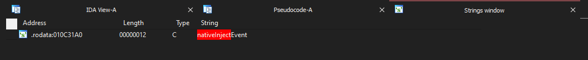
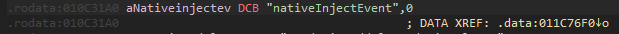
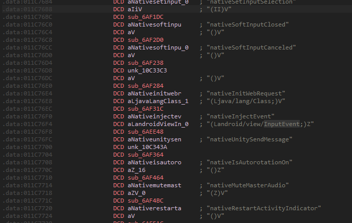
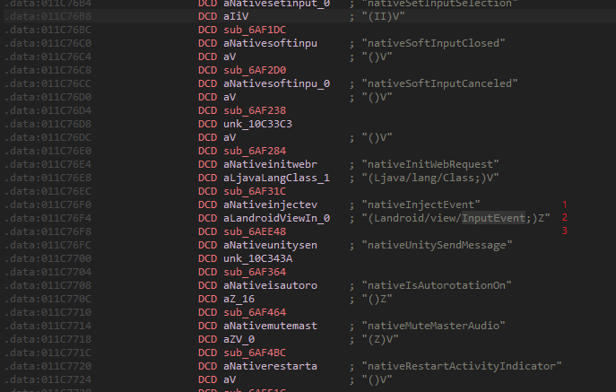
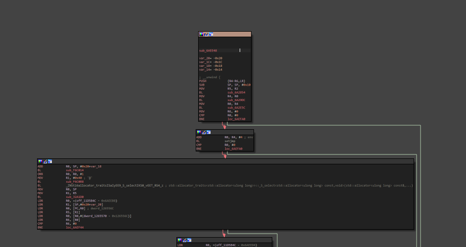
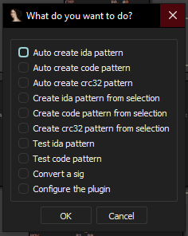
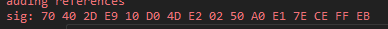

# How do I get the nativeInjectEvent signature?

It's quite simple.

Prerequesites:

Tools:
IDA
IDA [SigMaker Plugin](https://github.com/ajkhoury/SigMaker-x64)

First of open the libunity.so file in ida and wait for it to load.

Then open up the strings subview and search for the string "nativeInjectEvent"

click on it.

You should see this now:

Now click on ".data:xxxxx" which is next to "DATA XREF"

Now you should be here:

If you know how you register native methods via jni this should look familiar to you. If not click [here](https://github.com/Octowolve/Hooking-Template-With-Mod-Menu/blob/40ad2c2fd85ff850ce6a3b427c8c4f87e3bf3c7c/app/src/main/cpp/main.cpp#L139)

First the java function name, then the arguments and then its corresponding c++ function.

Its the same in our current ida view

1. Our Java function name
2. the arguments
3. the corresponding c++ function

So click on the corresponding c++ function.

You should now be greeted by this.

 But this doesn't really matter to us because we are simply using the sigmaker plugin now.

 Go to Edit > Plugins > SigMaker

 And Select "Auto Create IDA pattern"

 

 Click ok.

 You should now see something similar to this in the Output Window

 

 Copy this and use it in your code.

 

 You may test this signature with the SigMaker plugin by clicking in the sigmaker view on "Test ida pattern" before using it though.
